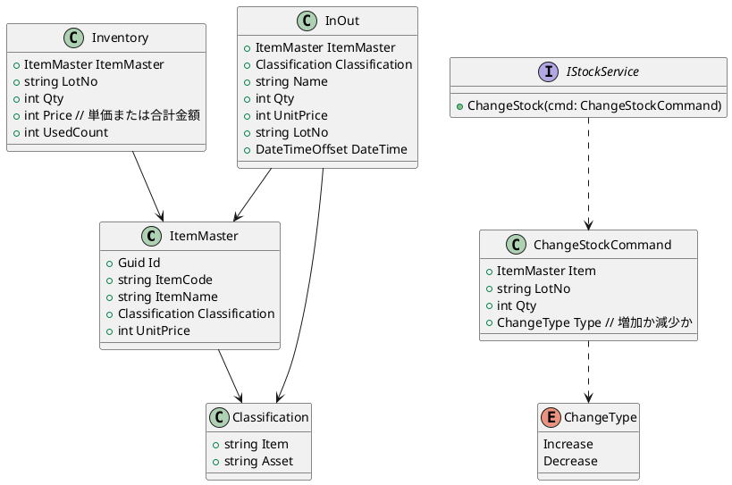

# 在庫管理アプリ設計図

---

## 1. アーキテクチャ構成（Clean Architecture準拠）

- Presentation（UI層）
- Application（ユースケース層）
- Domain（ドメイン層：エンティティ、アグリゲート、ドメインサービス、イベント、ポリシー）
- Infrastructure（永続化、外部サービス連携）

---

## 2. 主なユースケース（コマンド・イベント・リードモデル）

- 在庫の増減入力
- 棚卸の入力
- 月末在庫確定入力
- 在庫表示・ソート
- 棚卸実績取得
- 使用中在庫一覧取得

---

## 3. ドメインモデル（エンティティ・アグリゲート）

- ItemMaster（商品マスタ）
  - 商品コード（ItemCode）、商品名（ItemName）は初期化後変更不可（イミュータブル設計）。
  - 分類（Classification）は値オブジェクトとして保持。
  - 単価（UnitPrice）は不変。
  - 例：`readonly`や`private set;`を利用。

- Classification（分類）
  - 商品種別や資産区分など、分類基準を明確にする。
  - 値オブジェクトとして実装し、`Equals`や`GetHashCode`をオーバーライド。
  - 例：`public override bool Equals(object obj)` など。

- InOut（入出庫履歴）
  - どの商品（ItemMaster）が、いつ（DateTime）、どの分類（Classification）で、誰によって（Name）、どれだけ（Qty）、どのロット（LotNo）で入出庫されたかを記録。
  - `ItemMaster`に`Classification`が含まれる場合は冗長にならないよう設計。
  - 日時は`DateTimeOffset`の利用も検討。

- Inventory（在庫）
  - 商品（ItemMaster）、ロット（LotNo）、在庫数（Qty）、単価または合計金額（Price）、出庫回数（UsedCount）を管理。
  - `Price`は単価か合計金額か明確にし、命名やコメントで区別。
  - 在庫数と入出庫履歴の整合性を担保する設計を意識。

- IStockService（在庫操作インターフェース）
  - 在庫増減の操作を定義。
  - `ChangeStock`は、どの商品・ロット・数量・操作種別をCommandで明示。
  - 例：`void ChangeStock(ChangeStockCommand cmd)`

- ChangeStockCommand（在庫増減コマンド）
  - ItemMaster, LotNo, Qty, ChangeType（増加/減少）を保持。

- ChangeType（enum）
  - Increase, Decrease

---

## 4. コマンド・イベント・ポリシーの流れ

- Command: 在庫の増減入力 → Aggregate: 在庫 → Event: 実在庫の増減
- Command: 棚卸の入力 → Aggregate: 在庫 → Event: 実在庫の上書き
- Command: 月末在庫確定入力 → Aggregate: 在庫 → Event: 月末時点での在庫数の記録
- Command: 在庫表示 → Aggregate: 在庫 → Event: 在庫の取得 → ReadModel: 在庫の表示
- Command: 棚卸実績取得 → Aggregate: 在庫 → Event: 棚卸データの取得 → ReadModel: 棚卸実績の表示
- Command: 使用中在庫一覧取得 → Aggregate: 在庫 → Event: 使用中在庫の取得 → Policy: usedCountが1以上かつ在庫が1以上 → ReadModel: 使用中在庫一覧の表示

---

## 5. ファイル・プロジェクト構成例

- /Domain
  - Entities（ItemMaster, Classification, InOut, Inventory, IStockService, ChangeStockCommand, ChangeType）
  - Events
  - Policies
- /Application
  - Commands
  - Handlers
  - DTOs
- /Infrastructure
  - Repositories
  - Data
- /Web
  - vite react ts project
- Program.cs

---

## 6. クラス図（UMLテキスト表現）

### 足りないもの・追加提案
- コマンド（ChangeStockCommand）を追加し、増減を共通化。
- ChangeType（増加/減少）をenumで表現。
- 各エンティティの関連を明確化。
- 必要に応じて、イベントやリードモデル、リポジトリインターフェースも今後追加を検討。

---

この設計図をもとに、各層・各クラスの詳細設計や実装に進めます。
次に進めたい観点（例：クラス図、コマンド設計、API設計など）があれば教えてください。
